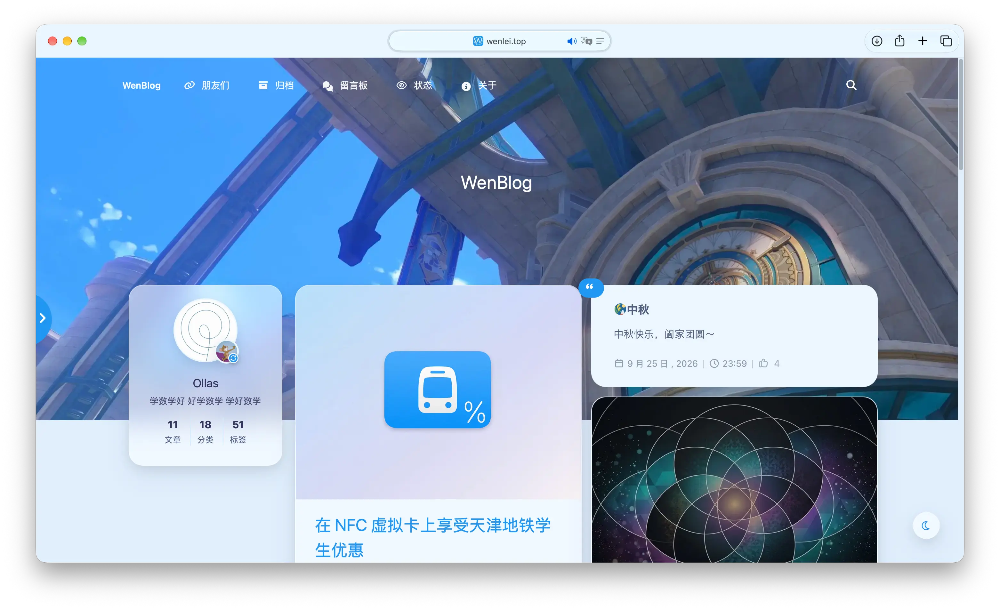

# Lyrargon
✨ Lyrargon - 一个轻盈、简洁的 WordPress 主题，基于 [solstice23](https://github.com/solstice23) 的 [argon-theme](https://github.com/solstice23/argon-theme) 改进.

 

  

# 特性

+ **基于 argon-theme 改进** - 在 argon-theme 的基础上进行了大量改进，改善了细节体验，增强了主题的可定制性和功能性
+ **轻盈美观** - 使用 **Argon Design System** 前端框架，细节精致，轻盈美观
+ **超定制化** - 可自定义主题色并应用于站点全局、布局自定义(双栏/单栏/三栏)、顶栏、侧栏等，提供了丰富的自定义选项
+ **毛玻璃效果** - 支持细致可控的毛玻璃通透材质，适配桌面与移动端，视觉效果温润通透
+ **夜间模式** - 支持日间/夜间/纯黑三种模式，并可以根据时间自动切换或跟随系统夜间模式
+ **完整多语言** - 支持简体中文、繁体中文、英文，可随系统语言自适应或在主题设置中指定
+ **服务状态监控看板** - 内置 UptimeRobot 服务状态监控集成，支持后台缓存与零网络阻塞的首屏渲染
+ **Pjax** - 支持 Pjax 无刷新加载，提高浏览体验
+ **友情链接** - 支持使用 WordPress 自带的链接管理器进行友链管理，支持多种友链样式
+ **"说说" 功能** - 随时发表想法，并在专门的 "说说" 页面展示，也支持说说和首页文章穿插
+ **评论功能扩展** - Ajax 评论，评论支持 Markdown、验证码、再次编辑、显示 UA、悄悄话模式、回复时邮件通知、查看编辑记录、无限加载等功能
+ **双人作者模式** - 侧边栏支持双人作者头像与简介展示，支持趣味动态互动切换
+ **诸多功能** - 文章目录、阅读进度、MathJax 或 KaTeX 公式解析、图片放大预览、Pangu.js 文本格式化、平滑滚动等
+ **丰富的短代码** - 支持通过短代码在文章中插入 TODO、标签、警告、提示、折叠区块、GitHub 信息卡、时间线、隐藏文本、视频等模块
+ **开箱即用** - 全面内置经过调优的默认配置，全新 WordPress 站点激活即具完整观感

# 安装

在 [Releases](https://github.com/Andy17269/lyrargon/releases) 页面下载最新的 `.zip` 文件，在 WordPress 后台 "外观 > 主题" 页面上传并启用。

# 文档

Lyrargon 主题文档：[https://lyrargon.wenlei.top](https://lyrargon.wenlei.top/)

# 注意

Lyrargon 使用 [GPL V3.0](https://github.com/Andy17269/lyrargon/blob/main/LICENSE) 协议基于 solstice23 的 argon-theme 修改并开源，请遵守此协议进行二次开发与分发。

您**必须在页脚保留 Lyrargon 主题的名称及其链接**，否则请不要使用 Lyrargon 主题。

您**可以删除**页脚的作者信息，但是**不能删除** Lyrargon 主题的名称和链接。